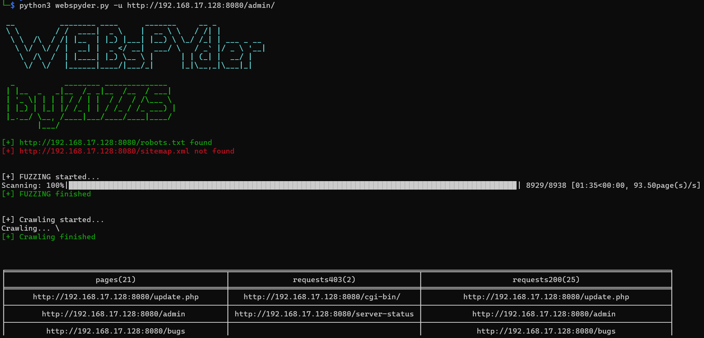

# Welcome to the WEBsPYder repository
Welcome to the official repository of WEBsPYder, a web directory scanner that can be useful for CTF players, Pentesters and Red Team Hackers who need to quickly collect all kinds of URLs and files that are in this web application.
# WEBsPYder [](https://www.python.org/downloads/)
## How does it work
WEBsPYder works in 3 modes:
1. robots.txt+sitemap.xml parser -> crawler
   + parser get URLs from sitemap.xml and robots.txt and gives them to parser, which recursively GETs every page and tries to find any links in them and so on and so on...
2. FUZZER
   + simple FUZZER, you know how it works. Just one iteration. Usefull on CTFs and small web applications.
3. robots.txt+sitemap.xml parser -> FUZZER -> crawler
   + the default mode and the best one. Combination of first and second modes, in this mode WEBsPYder parses robots.txt,sitemap.xml and FUZZes on 8000 different URLs, then gives it to crawler to increase the scanning area.
## How to install
Installation is very simple, just use this command:
``` bash
git clone https://github.com/zizzs3228/WEBsPYder.git --ignore screens/ && cd WEBsPYder && pip install -r requirements.txt
```
## How to use
This code:
```bash
python webspyder.py -h   
```
gives this output:
```bash
usage: WEBsPYder.py [-h] -u URL [-t THREADS] [-o OUTPUT] [-l LEVEL]

options:
  -h, --help            show this help message and exit
  -u URL, --URL URL     URL from site to scan. Example: -u http://example.com/admin
  -t THREADS, --threads THREADS
                        Number of threads to use. Example: -t 6
  -o OUTPUT, --output OUTPUT
                        Output file. Example: -o example
  -l LEVEL, --level LEVEL
                        Level of scan. 1 - only sitemap and robots.txt + crawler, 2 - FUZZING, 3 - FUZZING + crawler. Example: -l 3
```

#### _As you can see, it takes 4 arguments, but **only one is required** - `-u/--URL <URL>`_ 

Example:
```bash
python3 webspyder.py -u http://192.168.17.128:8080/admin/
```
Gives you this output:
<h3 align="center"></h3>
You get pages and 200 HTTP-answers, which you can explore for potential vulnerabilities, and 403, which you can try to bypass.
<h3 align="center"></h3>
But also you get tables with all found docx, pdf and xlsx files, which can be explored for social engineering purposes.

-----
Output saves in 2 files, with name, provided in `-o` parameter and `txt` and `json` extensions. `output` filename is default. 

TXT and JSON examples:
<table>
  <tr>
    <td align="center">
      
    </td>
    <td align="center">
      
    </td>
  </tr>
</table>


## Project Leader
### [zizzs](https://github.com/zizzs3228)